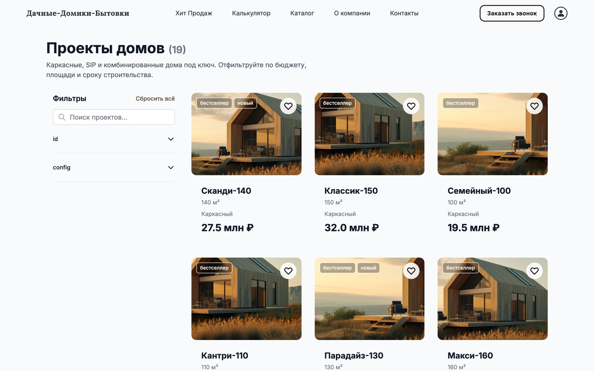
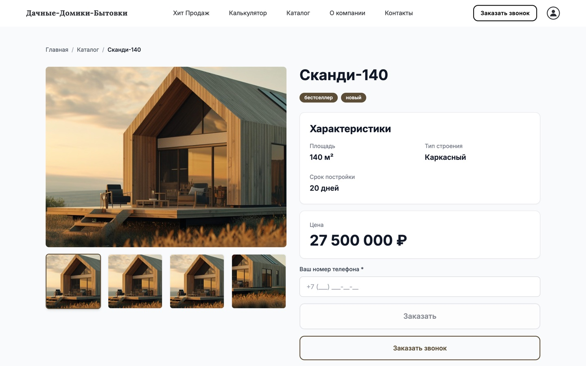

<div align="center">

# Дачные-Домики-Бытовки

**A frame-house and cabin store with 27 Prisma models — and an in-memory Prisma
stand-in so the whole thing runs with no database at all.**
19 catalog projects with price/area/material/deadline filters, a four-step price
calculator, WhatsApp lead capture, a client profile with favorites and compare, and a
15-block CMS behind `requireAdmin()`.

**Live:** [dachnye-domiki-bytovki.vercel.app](https://dachnye-domiki-bytovki.vercel.app)


</div>

---

## The problem

A builder of frame houses sells a configuration, not an SKU: area, material,
finished-ness, deadline and site logistics all move the price. Every such company
ends up with the same three artifacts — a catalog page, a "calculate price" form,
and a manager who answers WhatsApp.

The hard part is not building those. It is keeping 15 blocks of editable content
consistent between what a visitor sees, what the admin edits and what the seed
writes — which is exactly where this project had already broken.

## What makes it different

- **One source of truth for every editable block.** `lib/content/configs.ts` is the
  single place defaults live, and `prisma/seed.ts`, the public read routes, the admin
  write routes and the in-memory demo store all take their values from it. Before
  that, each of the 15 CMS blocks had its fallback written twice — once in
  `/api/<block>`, once in `/api/admin/<block>` — and the copies had drifted: the
  calculator offered **three** house types to visitors and **two** to the admin, and
  the WhatsApp message template was a full text in one file and the string
  `Шаблон MAX` in the other.
- **The demo store is a Prisma stand-in, not a fixture dump.** `lib/prisma.ts`
  exports `hasDatabase = Boolean(process.env.DATABASE_URL)` and routes every call to
  `createDemoStore()` (`lib/content/demo.ts`, 417 lines) when there is no
  connection string — so the same 59 route handlers, the same admin panel and the
  same profile pages work after `npm install` with zero infrastructure.
- **XSS is blocked at the API boundary, not in the renderer.**
  `lib/api.ts:82-84` rejects `script|iframe|object|embed|link|style|form|base` tags
  and `javascript:` URLs in `href|src|xlink:href|action|formaction` on the way in —
  which matters because the CMS stores HTML the admin writes and the storefront
  renders it.
- **argon2 is loaded lazily** (`lib/passwords.ts`), because a native module that
  fails to build on Vercel would take the whole deploy down; the demo build works
  without it.
- **Rate limiting covers every public write** — the WhatsApp lead form, the
  newsletter and the calculator request — via `lib/rate-limit.ts`.
- **Documents are generated, not typed.** `puppeteer` is a runtime dependency for
  rendering the contract and estimate a project produces from the calculator result.

## Stack and size

| 14 156 | 119 | 9 | 59 | 27 | 1 | 417 |
| --- | --- | --- | --- | --- | --- | --- |
| lines of TS/TSX | source files | pages | API routes | Prisma models | enums | lines in the demo store |

Next.js 14 App Router, React 18, TypeScript, Tailwind CSS, Framer Motion,
`lucide-react`. Prisma 6.18 on PostgreSQL, NextAuth 4 with JWT sessions and argon2
hashing, `zod` for validation, `nodemailer` for mail, `puppeteer` for documents.

---


🏠 [Домашняя страница](https://dachnye-domiki-bytovki.vercel.app) — Каркасные дома под ключ с калькулятором стоимости  
📦 [Каталог проектов](https://dachnye-domiki-bytovki.vercel.app/catalog) — 19 проектов с фильтром по цене, площади, материалу и срокам  
🔑 [Демо-вход](https://dachnye-domiki-bytovki.vercel.app/auth/signin) — `a@gmail.com` / `123`, после входа открывается [профиль](https://dachnye-domiki-bytovki.vercel.app/profile) с избранным и сравнением

---

---

## Описание проекта

**Дачные-Домики-Бытовки** — современный e-commerce сайт для компании по строительству каркасных дачных домиков и бытовок под ключ. 

### Ключевые возможности:
- ✅ **Демо-режим без базы данных** — работает сразу после `npm install`
- ✅ **Интерактивный калькулятор** — 4 этапа расчёта стоимости
- ✅ **Фильтрация каталога** — по цене, площади, материалу, срокам строительства
- ✅ **Адаптивный дизайн** — оптимизирован для мобильных и десктопов
- ✅ **CMS админ-панель** — управление проектами, отзывами, SEO текстами
- ✅ **WhatsApp интеграция** — сбор лидов прямо в мессенджер

### Технологии:
- **Frontend:** Next.js 14 App Router, React 18, TypeScript, Tailwind CSS, Framer Motion
- **Backend:** Prisma ORM + PostgreSQL (или in-memory demo store)
- **Auth:** NextAuth.js 4 с JWT сессиями, argon2 хеширование
- **Deployment:** Vercel (CLI deploys), demo store runs in memory when `DATABASE_URL` is absent

---

## 🎯 Quick Start

```bash
# Клонирование репозитория
git clone https://github.com/NikitaKoreshkov/dachnye-domiki-bytovki.git
cd dachnye-domiki-bytovki

# Установка зависимостей
npm install

# Демо режим (работает без БД!)
npm run dev

# Для production с базой данных:
cp .env.example .env
# Настройте DATABASE_URL и NEXTAUTH_SECRET в .env
npm run db:push
npm run db:seed
npm run build
npm start
```

---

## 📸 Screenshots

**Homepage (Desktop):**  


**Catalogue (19 projects):**  


**Project detail:**  


**Mobile Viewport (390px):**  


*Captured from the live Vercel build in October 2026 at 1440×900 and 390×844, 2x DPR, JPEG q84.*

---

## 🏗 Project Structure

```
dachnye-domiki-bytovki/
├── app/                      # Next.js App Router
│   ├── api/                  # API routes (public + guarded)
│   ├── auth/                 # Sign in and sign up pages
│   ├── catalog/              # Product catalogue page
│   ├── project/[id]/         # Single product detail
│   ├── profile/              # User area (favorites, compare, documents)
│   └── cookies/ privacy/ terms/  # Legal pages
├── components/               # React components
│   ├── content/              # CMS block components
│   └── catalog/              # Catalog UI components
├── lib/
│   ├── content/              # Content factory + mappers
│   ├── api.ts               # Unified error handling
│   ├── passwords.ts         # Lazy argon2 loader
│   ├── content/demo.ts        # In-memory Prisma stand-in (417 lines)
│   └── rate-limit.ts        # Public form protection
├── prisma/
│   └── schema.prisma        # 27 models + 1 enum, seeded fixtures
└── public/images/           # Hero render + 11 crop variants
```

---

## 🔐 Security Features

- Lazy loading argon2 (avoids native module failures on Vercel)
- Rate limiting on all public forms (WhatsAppLead, Newsletter, Calculator)
- HTML sanitization (blocks script, iframe, object, embed tags)
- Timing-safe password comparison
- requireAdmin()/requireSuperAdmin() guards on all mutations

---

## 🌐 Deployment

### Vercel (recommended):
1. Push to GitHub repository
2. Connect to Vercel
3. Set environment variables: `DATABASE_URL`, `NEXTAUTH_SECRET`, `NEXTAUTH_URL`
4. Auto-deploys on every push to main

### Manual deployment:
```bash
# Build for production
npm run build

# Deploy .next output to your host (Nginx, Docker, etc.)
```

---

## 📄 License

MIT License - © 2026 ИП ГЮЛЬАХМЕДОВ АТАЙ ЭДИСОНОВИЧ

---

**Дачные-Домики-Бытовки** — ваш каркасный дом мечты под ключ! 🏠✨
