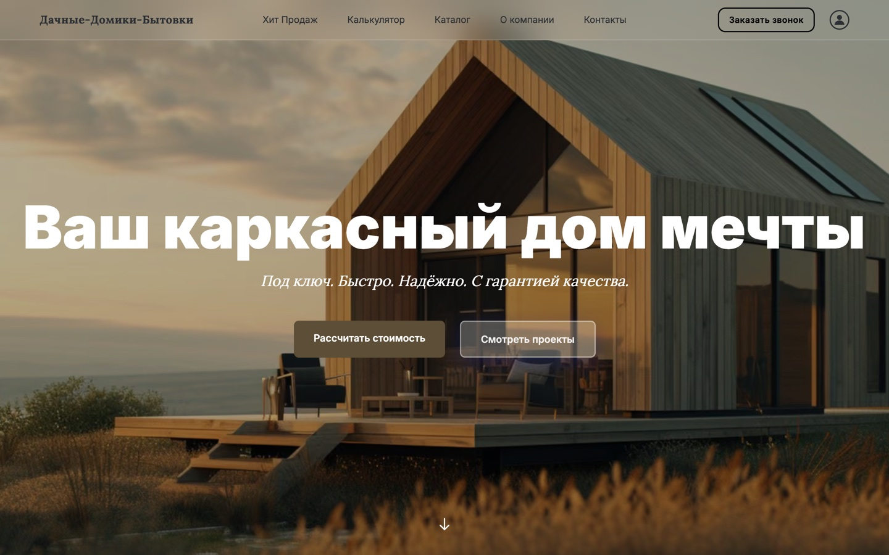
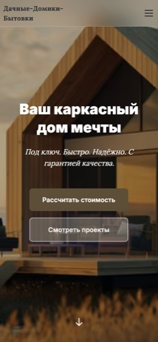

# Дачные-Домики-Бытовки

🏠 [Домашняя страница](https://dachnye-domiki-bytovki.vercel.app) — Каркасные дома под ключ с калькулятором стоимости  
📦 [Каталог проектов](https://dachnye-domiki-bytovki.vercel.app/catalog) — Фильтр по цене, площади, материалу и срокам  
⚙️ [Админ панель](https://dachnye-domiki-bytovki.vercel.app/admin) — Управление каталогом и контентом (demo login: a@gmail.com / 123)

---

## Описание проекта

**Дачные-Домики-Бытовки** — современный e-commerce сайт для компании по строительству каркасных дачных домиков и бытовок под ключ. 

### Ключевые возможности:
- ✅ **Демо-режим без базы данных** — работает сразу после `npm install`
- ✅ **Интерактивный калькулятор** — 4 этапа расчёта стоимости
- ✅ **Фильтрация каталога** — по цене, площади, материалу, срокам строительства
- ✅ **Адаптивный дизайн** — оптимизирован для мобильных и десктопов
- ✅ **CMS админ-панель** — управление проектами, отзывами, SEO текстами
- ✅ **WhatsApp интеграция** — сбор лидов прямо в мессенджер

### Технологии:
- **Frontend:** Next.js 14 App Router, React 18, TypeScript, Tailwind CSS, Framer Motion
- **Backend:** Prisma ORM + PostgreSQL (или in-memory demo store)
- **Auth:** NextAuth.js 4 с JWT сессиями, argon2 хеширование
- **Deployment:** Vercel with auto-deploy on push to main

---

## 🎯 Quick Start

```bash
# Клонирование репозитория
git clone https://github.com/NikitaKoreshkov/dachnye-domiki-bytovki.git
cd dachnye-domiki-bytovki

# Установка зависимостей
npm install

# Демо режим (работает без БД!)
npm run dev

# Для production с базой данных:
cp .env.example .env
# Настройте DATABASE_URL и NEXTAUTH_SECRET в .env
npm run db:push
npm run db:seed
npm run build
npm start
```

---

## 📸 Screenshots

**Homepage (Desktop):**  


**Mobile Viewport (390px):**  


*(Note: Screenshots will be captured from live deployment and added here)*

---

## 🏗 Project Structure

```
dachnye-domiki-bytovki/
├── app/                      # Next.js App Router
│   ├── (public)/             # Marketing landing pages
│   ├── admin/                # Admin dashboard
│   ├── api/                  # API routes (public + guarded)
│   ├── catalog/              # Product catalogue page
│   ├── project/[id]/         # Single product detail
│   └── profile/              # User area (favorites, compare, documents)
├── components/               # React components
│   ├── content/              # CMS block components
│   └── catalog/              # Catalog UI components
├── lib/
│   ├── content/              # Content factory + mappers
│   ├── api.ts               # Unified error handling
│   ├── passwords.ts         # Lazy argon2 loader
│   ├── demo.ts              # In-memory Prisma store
│   └── rate-limit.ts        # Public form protection
├── prisma/
│   └── schema.prisma        # 26 models, seeded fixtures
└── public/images/           # Hero render + 11 crop variants
```

---

## 🔐 Security Features

- Lazy loading argon2 (avoids native module failures on Vercel)
- Rate limiting on all public forms (WhatsAppLead, Newsletter, Calculator)
- HTML sanitization (blocks script, iframe, object, embed tags)
- Timing-safe password comparison
- requireAdmin()/requireSuperAdmin() guards on all mutations

---

## 🌐 Deployment

### Vercel (recommended):
1. Push to GitHub repository
2. Connect to Vercel
3. Set environment variables: `DATABASE_URL`, `NEXTAUTH_SECRET`, `NEXTAUTH_URL`
4. Auto-deploys on every push to main

### Manual deployment:
```bash
# Build for production
npm run build

# Deploy .next output to your host (Nginx, Docker, etc.)
```

---

## 📄 License

MIT License - © 2026 ИП ГЮЛЬАХМЕДОВ АТАЙ ЭДИСОНОВИЧ

---

**Дачные-Домики-Бытовки** — ваш каркасный дом мечты под ключ! 🏠✨
